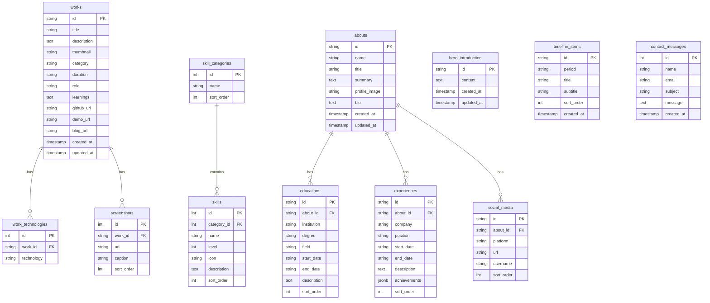

# データベース設計

## 1. 概要

### 1.1 データベース管理システム
- **DBMS**: Supabase (PostgreSQL 15+)
- **接続方法**: Supabase Python Client / Supabase JS Client
- **環境**: 開発環境（Mock Mode）、本番環境（Supabase）

### 1.2 設計方針
1. **正規化**: 第3正規形を基本とし、必要に応じて非正規化
2. **命名規則**: スネークケース（snake_case）
3. **主キー**: `id` カラム（UUID または SERIAL）
4. **外部キー**: 参照整合性制約を設定
5. **タイムスタンプ**: `created_at`, `updated_at` カラムを標準装備

---

## 2. ER図



---

## 3. テーブル定義

### 3.1 Works（作品情報）

#### テーブル: `works`

| カラム名 | 型 | 制約 | 説明 |
|---------|------|------|------|
| id | VARCHAR(50) | PRIMARY KEY | 作品ID（例: "work-1"） |
| title | VARCHAR(200) | NOT NULL | 作品タイトル |
| description | TEXT | NOT NULL | 作品の説明 |
| thumbnail | VARCHAR(500) | NOT NULL | サムネイル画像URL |
| category | VARCHAR(100) | NULL | カテゴリ（例: "Web Development"） |
| duration | VARCHAR(100) | NULL | 開発期間（例: "2024.10 - 2024.12"） |
| role | VARCHAR(100) | NULL | 担当役割（例: "フロントエンド開発"） |
| learnings | TEXT | NULL | 学びや成果 |
| github_url | VARCHAR(500) | NULL | GitHubリポジトリURL |
| demo_url | VARCHAR(500) | NULL | デモサイトURL |
| blog_url | VARCHAR(500) | NULL | ブログ記事URL |
| created_at | TIMESTAMP | DEFAULT NOW() | 作成日時 |
| updated_at | TIMESTAMP | DEFAULT NOW() | 更新日時 |

**インデックス**:
- PRIMARY KEY (`id`)
- INDEX on `category`
- INDEX on `created_at` (DESC)

**サンプルデータ**:
```sql
INSERT INTO works (id, title, description, thumbnail, category, github_url) VALUES
('work-1', 'Portfolio Website', 'モダンなポートフォリオサイト。Next.js 15、Tailwind CSS、Framer Motionを使用。', '/works/portfolio.png', 'Web Development', 'https://github.com/shunsuke-aoki/portfolio');
```

---

#### テーブル: `work_technologies`

| カラム名 | 型 | 制約 | 説明 |
|---------|------|------|------|
| id | SERIAL | PRIMARY KEY | 自動採番ID |
| work_id | VARCHAR(50) | NOT NULL, FK | 作品ID（works.id参照） |
| technology | VARCHAR(100) | NOT NULL | 技術名（例: "Next.js"） |

**外部キー**:
- `work_id` REFERENCES `works(id)` ON DELETE CASCADE

**インデックス**:
- PRIMARY KEY (`id`)
- INDEX on `work_id`

**サンプルデータ**:
```sql
INSERT INTO work_technologies (work_id, technology) VALUES
('work-1', 'Next.js'),
('work-1', 'React'),
('work-1', 'TypeScript'),
('work-1', 'Tailwind CSS'),
('work-1', 'FastAPI');
```

---

#### テーブル: `screenshots`

| カラム名 | 型 | 制約 | 説明 |
|---------|------|------|------|
| id | SERIAL | PRIMARY KEY | 自動採番ID |
| work_id | VARCHAR(50) | NOT NULL, FK | 作品ID（works.id参照） |
| url | VARCHAR(500) | NOT NULL | スクリーンショット画像URL |
| caption | VARCHAR(200) | NULL | キャプション |
| sort_order | INT | DEFAULT 0 | 表示順序 |

**外部キー**:
- `work_id` REFERENCES `works(id)` ON DELETE CASCADE

**インデックス**:
- PRIMARY KEY (`id`)
- INDEX on `work_id, sort_order`

---

### 3.2 Skills（スキル情報）

#### テーブル: `skill_categories`

| カラム名 | 型 | 制約 | 説明 |
|---------|------|------|------|
| id | SERIAL | PRIMARY KEY | カテゴリID |
| name | VARCHAR(100) | NOT NULL | カテゴリ名（例: "Languages"） |
| sort_order | INT | DEFAULT 0 | 表示順序 |

**インデックス**:
- PRIMARY KEY (`id`)
- UNIQUE INDEX on `name`
- INDEX on `sort_order`

**サンプルデータ**:
```sql
INSERT INTO skill_categories (name, sort_order) VALUES
('Languages', 1),
('Frameworks', 2),
('Tools & Cloud', 3);
```

---

#### テーブル: `skills`

| カラム名 | 型 | 制約 | 説明 |
|---------|------|------|------|
| id | SERIAL | PRIMARY KEY | スキルID |
| category_id | INT | NOT NULL, FK | カテゴリID（skill_categories.id参照） |
| name | VARCHAR(100) | NOT NULL | スキル名（例: "Python"） |
| level | INT | NOT NULL | スキルレベル（0-100） |
| icon | VARCHAR(200) | NULL | アイコンURL or アイコン名 |
| description | TEXT | NULL | スキルの説明 |
| sort_order | INT | DEFAULT 0 | カテゴリ内での表示順序 |

**外部キー**:
- `category_id` REFERENCES `skill_categories(id)` ON DELETE CASCADE

**制約**:
- CHECK (`level` >= 0 AND `level` <= 100)

**インデックス**:
- PRIMARY KEY (`id`)
- INDEX on `category_id, sort_order`

**サンプルデータ**:
```sql
INSERT INTO skills (category_id, name, level, sort_order) VALUES
(1, 'Python', 90, 1),
(1, 'JavaScript', 85, 2),
(1, 'TypeScript', 85, 3),
(2, 'FastAPI', 90, 1),
(2, 'React', 85, 2),
(2, 'Next.js', 80, 3);
```

---

### 3.3 About（プロフィール情報）

#### テーブル: `abouts`

| カラム名 | 型 | 制約 | 説明 |
|---------|------|------|------|
| id | VARCHAR(50) | PRIMARY KEY | プロフィールID（通常1件のみ） |
| name | VARCHAR(100) | NOT NULL | 名前 |
| title | VARCHAR(200) | NOT NULL | 肩書き（例: "Robotics Researcher & Developer"） |
| summary | TEXT | NOT NULL | サマリー（1-2行） |
| profile_image | VARCHAR(500) | NOT NULL | プロフィール画像URL |
| bio | TEXT | NOT NULL | 詳細な自己紹介 |
| created_at | TIMESTAMP | DEFAULT NOW() | 作成日時 |
| updated_at | TIMESTAMP | DEFAULT NOW() | 更新日時 |

**インデックス**:
- PRIMARY KEY (`id`)

**サンプルデータ**:
```sql
INSERT INTO abouts (id, name, title, summary, profile_image, bio) VALUES
('default', 'Shunsuke Aoki', 'Robotics Researcher & Developer', '早稲田大学創造理工学研究科の修士1年生として、AIロボティクスの研究に従事。', '/profile.jpg', 'プログラミングとAIに情熱を持つエンジニアです。');
```

---

#### テーブル: `educations`

| カラム名 | 型 | 制約 | 説明 |
|---------|------|------|------|
| id | VARCHAR(50) | PRIMARY KEY | 学歴ID |
| about_id | VARCHAR(50) | NOT NULL, FK | プロフィールID（abouts.id参照） |
| institution | VARCHAR(200) | NOT NULL | 機関名（例: "早稲田大学"） |
| degree | VARCHAR(100) | NOT NULL | 学位（例: "修士"） |
| field | VARCHAR(200) | NOT NULL | 専攻分野 |
| start_date | VARCHAR(20) | NOT NULL | 開始日（例: "2025.4"） |
| end_date | VARCHAR(20) | NULL | 終了日（例: "現在"） |
| description | TEXT | NULL | 詳細説明 |
| sort_order | INT | DEFAULT 0 | 表示順序 |

**外部キー**:
- `about_id` REFERENCES `abouts(id)` ON DELETE CASCADE

**インデックス**:
- PRIMARY KEY (`id`)
- INDEX on `about_id, sort_order`

---

#### テーブル: `experiences`

| カラム名 | 型 | 制約 | 説明 |
|---------|------|------|------|
| id | VARCHAR(50) | PRIMARY KEY | 職歴ID |
| about_id | VARCHAR(50) | NOT NULL, FK | プロフィールID（abouts.id参照） |
| company | VARCHAR(200) | NOT NULL | 企業名 |
| position | VARCHAR(100) | NOT NULL | 役職 |
| start_date | VARCHAR(20) | NOT NULL | 開始日（例: "2024.10"） |
| end_date | VARCHAR(20) | NULL | 終了日（例: "現在"） |
| description | TEXT | NULL | 業務内容説明 |
| achievements | JSONB | NULL | 実績リスト（JSON配列） |
| sort_order | INT | DEFAULT 0 | 表示順序 |

**外部キー**:
- `about_id` REFERENCES `abouts(id)` ON DELETE CASCADE

**インデックス**:
- PRIMARY KEY (`id`)
- INDEX on `about_id, sort_order`

**achievements サンプル**:
```json
["自然言語処理モデルの実装と改良", "APIの設計と開発"]
```

---

#### テーブル: `social_media`

| カラム名 | 型 | 制約 | 説明 |
|---------|------|------|------|
| id | VARCHAR(50) | PRIMARY KEY | SNS ID |
| about_id | VARCHAR(50) | NOT NULL, FK | プロフィールID（abouts.id参照） |
| platform | VARCHAR(50) | NOT NULL | プラットフォーム名（例: "GitHub"） |
| url | VARCHAR(500) | NOT NULL | プロフィールURL |
| username | VARCHAR(100) | NULL | ユーザー名 |
| sort_order | INT | DEFAULT 0 | 表示順序 |

**外部キー**:
- `about_id` REFERENCES `abouts(id)` ON DELETE CASCADE

**インデックス**:
- PRIMARY KEY (`id`)
- INDEX on `about_id, sort_order`

---

### 3.4 Hero（ヒーローセクション情報）

#### テーブル: `hero_introduction`

| カラム名 | 型 | 制約 | 説明 |
|---------|------|------|------|
| id | VARCHAR(50) | PRIMARY KEY | イントロID（通常1件のみ） |
| content | TEXT | NOT NULL | 自己紹介文 |
| created_at | TIMESTAMP | DEFAULT NOW() | 作成日時 |
| updated_at | TIMESTAMP | DEFAULT NOW() | 更新日時 |

**インデックス**:
- PRIMARY KEY (`id`)

**サンプルデータ**:
```sql
INSERT INTO hero_introduction (id, content) VALUES
('default', '早稲田大学創造理工学研究科の修士1年生として、AIロボティクスの研究に従事。また、長期インターンでWebエンジニアとしてAIを活用したwebアプリケーション開発に努める。');
```

---

#### テーブル: `timeline_items`

| カラム名 | 型 | 制約 | 説明 |
|---------|------|------|------|
| id | VARCHAR(50) | PRIMARY KEY | タイムラインアイテムID |
| period | VARCHAR(50) | NOT NULL | 期間（例: "2024.10 - 現在"） |
| title | VARCHAR(200) | NOT NULL | タイトル |
| subtitle | VARCHAR(200) | NULL | サブタイトル |
| sort_order | INT | NOT NULL | 表示順序（昇順） |
| created_at | TIMESTAMP | DEFAULT NOW() | 作成日時 |

**インデックス**:
- PRIMARY KEY (`id`)
- INDEX on `sort_order`

**サンプルデータ**:
```sql
INSERT INTO timeline_items (id, period, title, subtitle, sort_order) VALUES
('default-1', '2018.4 - 2021.3', '早稲田高等学校', NULL, 1),
('default-2', '2021.4 - 2024.3', '早稲田大学 創造理工学部 総合機械工学科', '学士課程', 2),
('default-3', '2024.10 - 現在', '株式会社インテリジェントフォース', 'AIソリューション事業部 - AIエンジニア', 3);
```

---

### 3.5 Contact（お問い合わせ情報）

#### テーブル: `contact_messages`

| カラム名 | 型 | 制約 | 説明 |
|---------|------|------|------|
| id | SERIAL | PRIMARY KEY | メッセージID |
| name | VARCHAR(100) | NOT NULL | 送信者名 |
| email | VARCHAR(200) | NOT NULL | メールアドレス |
| subject | VARCHAR(200) | NOT NULL | 件名 |
| message | TEXT | NOT NULL | メッセージ本文 |
| created_at | TIMESTAMP | DEFAULT NOW() | 送信日時 |

**インデックス**:
- PRIMARY KEY (`id`)
- INDEX on `created_at` (DESC)
- INDEX on `email`

**制約**:
- CHECK (email ~* '^[A-Za-z0-9._%+-]+@[A-Za-z0-9.-]+\.[A-Z|a-z]{2,}$')  # メール形式チェック

---

## 4. データ整合性制約

### 4.1 外部キー制約

| 親テーブル | 子テーブル | 外部キー | ON DELETE |
|-----------|----------|---------|----------|
| works | work_technologies | work_id | CASCADE |
| works | screenshots | work_id | CASCADE |
| skill_categories | skills | category_id | CASCADE |
| abouts | educations | about_id | CASCADE |
| abouts | experiences | about_id | CASCADE |
| abouts | social_media | about_id | CASCADE |

### 4.2 CHECK制約

```sql
-- スキルレベルは0-100の範囲
ALTER TABLE skills ADD CONSTRAINT check_level_range CHECK (level >= 0 AND level <= 100);

-- メールアドレス形式検証
ALTER TABLE contact_messages ADD CONSTRAINT check_email_format CHECK (email ~* '^[A-Za-z0-9._%+-]+@[A-Za-z0-9.-]+\.[A-Z|a-z]{2,}$');
```

---

## 5. インデックス戦略

### 5.1 主キーインデックス
すべてのテーブルで `id` カラムに PRIMARY KEY インデックス（自動作成）

### 5.2 外部キーインデックス
外部キー参照列（`work_id`, `category_id`, `about_id`）にインデックス作成（JOIN性能向上）

### 5.3 ソート用インデックス
- `sort_order` カラム（表示順序）
- `created_at` カラム（DESC）

### 5.4 検索用インデックス
- `works.category`（カテゴリフィルタリング）
- `skill_categories.name`（UNIQUE）

---

## 6. マイグレーション戦略

### 6.1 初期スキーマ作成

```sql
-- 1. Works関連
CREATE TABLE works (...);
CREATE TABLE work_technologies (...);
CREATE TABLE screenshots (...);

-- 2. Skills関連
CREATE TABLE skill_categories (...);
CREATE TABLE skills (...);

-- 3. About関連
CREATE TABLE abouts (...);
CREATE TABLE educations (...);
CREATE TABLE experiences (...);
CREATE TABLE social_media (...);

-- 4. Hero関連
CREATE TABLE hero_introduction (...);
CREATE TABLE timeline_items (...);

-- 5. Contact関連
CREATE TABLE contact_messages (...);
```

### 6.2 バージョン管理

Supabase Migration機能を使用:
```bash
supabase migration create initial_schema
supabase db push
```

---

## 7. バックアップ・復旧戦略

### 7.1 バックアップ
- Supabase 自動バックアップ（毎日）
- 定期的な手動エクスポート（週1回）

### 7.2 復旧手順
1. Supabaseコンソールからバックアップ選択
2. リストア実行
3. データ整合性確認

---

## 8. パフォーマンス最適化

### 8.1 クエリ最適化

```sql
-- 悪い例（N+1問題）
SELECT * FROM works;
-- 各workに対してSELECT * FROM work_technologies WHERE work_id = ?

-- 良い例（JOIN使用）
SELECT w.*, array_agg(wt.technology) as technologies
FROM works w
LEFT JOIN work_technologies wt ON w.id = wt.work_id
GROUP BY w.id;
```

### 8.2 接続プーリング

Supabase Connection Pooler使用（pgBouncer）

---

## 9. セキュリティ

### 9.1 Row Level Security (RLS)

```sql
-- 例: contact_messages は誰でも INSERT可能、SELECT は管理者のみ
ALTER TABLE contact_messages ENABLE ROW LEVEL SECURITY;

CREATE POLICY "Anyone can insert contact messages"
ON contact_messages FOR INSERT
TO public
WITH CHECK (true);

CREATE POLICY "Only admins can view contact messages"
ON contact_messages FOR SELECT
TO authenticated
USING (auth.role() = 'admin');
```

### 9.2 暗号化

- 通信: TLS/SSL（Supabaseデフォルト）
- データ: PostgreSQL暗号化ストレージ

---

## 10. まとめ

このデータベース設計は、以下の原則に基づく:

1. **正規化と一貫性**: 第3正規形、外部キー制約
2. **パフォーマンス**: 適切なインデックス、クエリ最適化
3. **拡張性**: sort_order による柔軟な表示順序制御
4. **セキュリティ**: RLS、CHECK制約
5. **開発効率**: Mock Dataフォールバック対応

詳細な型定義は `07_type_definitions.md` を参照。
